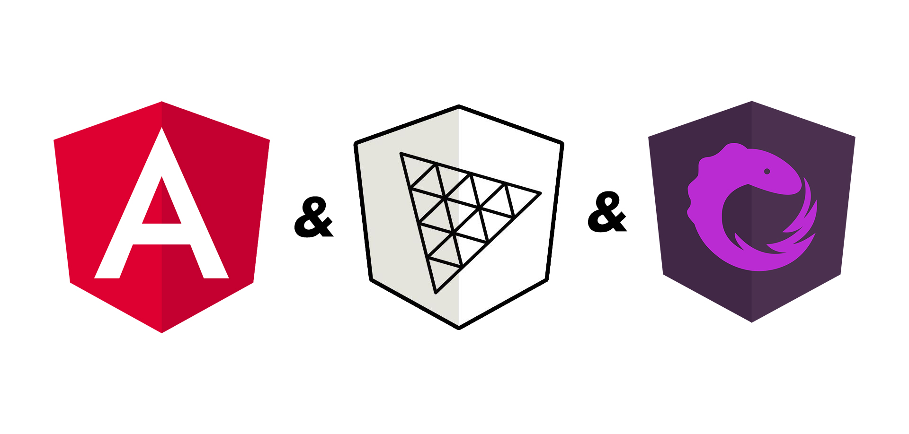

<div align="center">
    <b>Basic scaffolding for Angular Three projects with NgRx</b>
</div>

## Table of contents 👇

- [✨ How to install](#-how-to-install)
- [🔧 Project scaffolding](#-project-scaffolding)
- [🔥 Install dependencies](#-install-dependencies)
- [🚀 Deployment](#-deployment)

## ✨ How to install

Simply run `git clone` and then `npm install --legacy-peer-deps`.

## 🔧 Project scaffolding

Inside `app` folder there are several new directories as you can see in the following scaffolding.

.
├── core
│ └── models
├── state
│ ├── actions
│ ├── reducers
│ └── selectors
└── ...

## 🔥 Install dependencies

- Install Angular Three with `npm install --save-dev @angular-three/schematics ` and `npx nx generate @angular-three/schematics:init`
- Install NGRX with `nnpm install @ngrx/store --save`.
- Install NgRx DevToos with `npm install @ngrx/store-devtools --save --legacy-peer-deps` and add

```js
StoreDevtoolsModule.instrument({
      maxAge: 25,
      logOnly: environment.production,
    }),
```

into the `app.modulle.ts`. Then, you need add a Chrome extension called [Redux devtoos](https://chrome.google.com/webstore/detail/redux-devtools/lmhkpmbekcpmknklioeibfkpmmfibljd?hl=es) in order to add a new tab in _Developer tools_ of Chrone.

If you need to install another Angular Three dependency (for example Soba) add it with `npm i @angular-three/soba --legacy-peer-deps`.

## 🚀 Deployment

The project is deployed on **Netlify**. We had some troubles during deployment, for example, we added an **environment variable** called `NPM_FLAGS` with `--legacy-peer-deps`.

You can check it out at [this link](https://angular-ngrx-threejs.netlify.app/)
